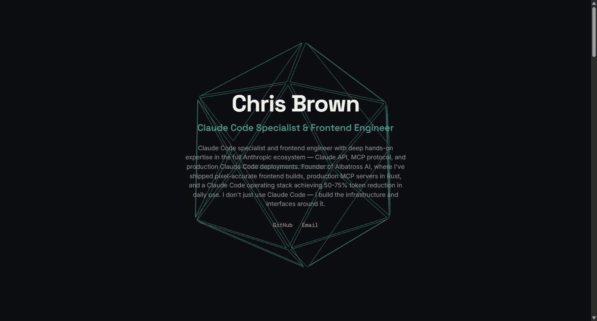

<p align="center">
  
</p>

Personal developer portfolio — a scroll-driven showcase of 5 real projects, built with **Next.js**, **React Three Fiber**, and **GSAP ScrollTrigger**.

**Live**: [chrisbrown-dev.vercel.app](https://chrisbrown-dev.vercel.app)

---

## The Hero Effect

The animated GIF above is the actual live site, not a mockup — an icosahedron made of 20 individually-addressable triangular faces that breathes, explodes outward, and reassembles in a continuous GSAP-driven loop. Each face also independently launches and fades whenever it rotates to point directly at the viewer, so no two loops look quite the same. The same face-explode technique is reused (with a 6-face cube) for the placeholder art on each project section below the hero.

## Projects Showcased

The site is a scroll-driven tour through 5 real projects:

- **Skinstric AI** — 7-screen AI skin-analysis flow, Frontend Simplified internship project
- **vuln-hunter** — hybrid Semgrep + Claude security scanner
- **AI Infrastructure** — RAG system + Omni Dashboard, agentic workflows
- **agentic-rust-mcp** — production Rust MCP server integrating Render, Vercel, Buffer, and Firestore
- **job-lead-discovery** — agentic job-lead scraping + outreach automation

## Tech Stack

- **Next.js** — app framework
- **React Three Fiber** — the 3D icosahedron/cube hero effects
- **GSAP ScrollTrigger** — scroll-driven animation sequencing
- Charcoal / amber / teal palette, Space Grotesk / Inter / IBM Plex Mono typefaces — a distinct visual identity from the Albatross AI brand

## Development

```bash
npm run dev
```

Open [http://localhost:3000](http://localhost:3000).

See `BUILDLOG.md` for session-by-session build history and `DECISIONS.md` for architecture/design rationale.

---

## Author

Chris Brown  
[Albatross AI](https://albatrossai.online)  
[Portfolio](https://chrisbrown-dev.vercel.app)
